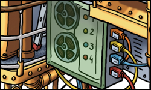

.. _api:

API
###

The Flying Circus provides an API that enables you to interact with our
platform in a programmatic way: creating, updating, and deleting resources
like virtual machines, service users, granting permissions, and retrieving
information about the usage of those resources platform.

.. note::

  The API is currently under development and only available to selected customers and resource groups at the moment. Please be careful: accidents may happen and cause downtime or data loss.

  If you're interested in accessing the Flying Circus through an API, `let us know <mailto:support@flyingcircus.io>`_!

.. toctree::
   :titlesonly:
   :maxdepth: 1

   introduction
   methods
   types
   log
   examples

