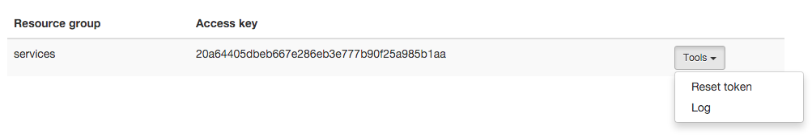
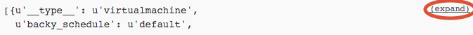
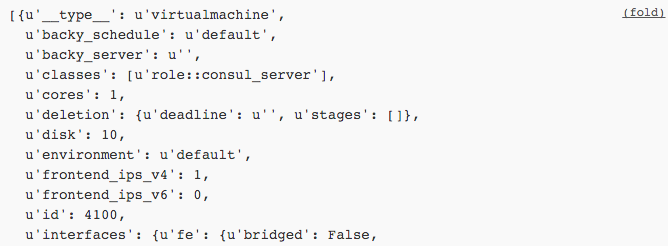

Log
===

You can access a log of all calls made to the API for a project by
visiting `your API page <https://my.flyingcircus.io/api/tokens>`_ and selecting
the ``Log`` utility for a project:

The log shows all calls (successful or not) including their parameters
and results (or errors) and keeps them for 30 days.

Long results are folded by default. They are marked with an ``(expand)`` badge
and can be clicked to show them completely:

.. note::

    The log itself is also available throug the API.
    See the :ref:`log() method <log-method>`.

