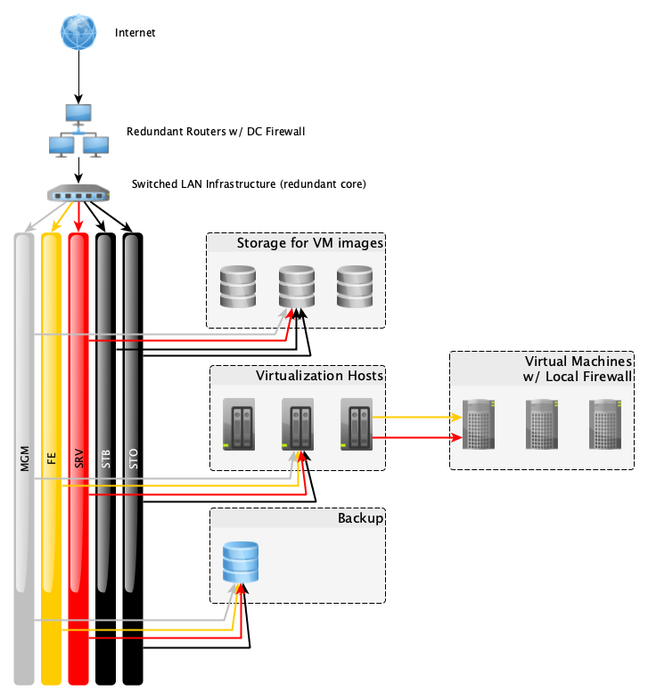

.. _networking_overview:

Overview
========

Physical networks
-----------------

The physical network is implemented with Gigabit Ethernet switches for frontend
and management access, and 10 Gigabit Ethernet switches for intra-server and
storage access.  For traffic separation we leverage :abbr:`VLANs (virtual local
area networks)` and provide physical servers with a dedicated link for each VLAN
that it needs access to.

Routers are attached to upstream ports provided by the data center, a dedicated
management link, and a link with tagged VLANs for everything else.

.. _logical_networks:
.. _virtual_networks:

Virtual networks
----------------

The following VLAN classes are in use:

**MGM** - Management, purely for administrative purposes. This VLAN connects
switch management ports, Remote Access Controllers, and typically provides a
separate point of entry so that administrator can use management features even
in the case that the routers are completely offline. Not accessible from the
outside world, private IPv4 address space. DNS example:
*switch.mgm.rzob.gocept.net*.

**FE** - Frontend, for providing actual service traffic. This VLAN connects to
machines that provide customers' applications to the public. This network is
switched to the virtual machines and leverages completely public traffic. The
DC firewalls to not filter this. Customer applications are free to use any
ports they like but must be careful opening them. VMs can filter this network
locally. All VMs receive a NIC on this VLAN but not necessarily IPv4 addresses
if they do not provide public traffic. DNS example: *vm00.fe.rzob.gocept.net*.

**SRV** - Server to server communication. Used for customer application
components to talk to each other, e.g. database traffic and for management
purposes on the application level. This network is firewalled from the DC
firewalls and allows only HTTP/S and SSH traffic. Additionally VMs can filter
this traffic locally and only allow free traffic by default from VMs belonging
to the same resource group. All VMs have this NIC used and addresses
allocated. DNS example: *vm00.srv.rzob.gocept.net* or simply
*vm00.gocept.net*.

**STO** - Storage communication. Used by the virtualization and backup servers
to access the network storages where the VM disk images are located. DNS
example: *filer.sto.rzob.gocept.net*.

**STB** - Storage backend communication. Used by the storage layer for
replication and self-management. DNS example: *filer.stb.rzob.gocept.net*.

Individual VMs that run management services, like monitoring, may get bridged
into the additional VLANs as necessary.

The routers suppress routing of IP networks on VLANs not belonging there.

Services that require tight control are bound to listening IP addresses on only
those networks but then can get relaxed ACL rules making configuration simpler
and easier to understand.

Local ports
-----------

Your application is generally free to use any open port on a machine above 1024.
Especially if you run a component that has a registered, well-known port, please
use that.

However, custom applications may run into the trouble of colliding with other
components. For that we guarantee that the ports 61000-61999 will never be used
by our managed components, nor by the kernel when assigning dynamic ports.
