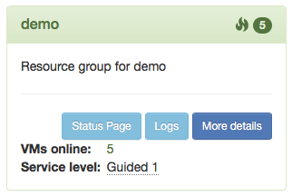

.. _nixos-loghost:

Loghost
=======

The Loghost role starts a managed instance of `Graylog <http://www.graylog.org>`_ 2.1.1.

Components
----------

.. image:: ../../images/graylog_min_arch.png
  :class: logo
  :width: 250px

Nginx
~~~~~

One instance (:ref:`srv interface <logical_networks>`, port TCP 9000) passes logins via `My Flying Circus <https://my.flyingcircus.io>`_ to the web interface of Graylog.

The other (:ref:`srv interface <logical_networks>`, port TCP 9002) is meant for VMs in the same project to access the Graylog API directly.

Graylog
~~~~~~~

Graylog saves user configs and settings in a mongodb, while ingested messages are stored in :ref:`Elasticsearch <nixos-elasticsearch>`.

Interaction
-------------

Activating the role adds a button at the most right position of a `VM entry <https://my.flyingcircus.io>`_. From there on you will be transferred to Graylog's dashboard. Doing that for the first time, a user with admin rights and your current login name will be created.

Alternatively, the url to access the dashboard directly is constructed like this:

``http://my.flyingcircus.io/tools/<machine>/graylog/``

API
~~~
Graylog implements its web interface as a first consumer of its REST api. One can also access it directly via

``http://my.flyingcircus.io/tools/<machine>/graylog/api``
``http://my.flyingcircus.io/tools/<machine>/graylog/api/api-browser`` (live documentation)

There is an ``admin`` user setup, which password is to be found in :file:`/etc/local/graylog/password`.

Inputs
------

The following inputs are active by default:

* Syslog UDP on port 10514

