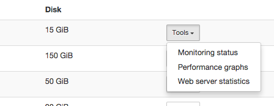

.. _firststeps:

Tutorial
========

Welcome to the Flying Circus!

For this tutorial we assume that you have ordered a virtual machine and we
finished provisioning it for you.

To get you started we would like to take you on a quick tour with the following
parts:

.. contents::
    :local:
    :depth: 1

Projects
--------

When you ordered a virtual machine, we asked you for a project name. Let's
assume your project is called `myapp`. Based on this we gave your first virtual
machine the name `myapp00`. This way you are ready to add more resources to
your project when needed without having to invent further names. Additional
virtual machines will be called subsequently: `myapp01`, `myapp02`, and so on.

At Flying Circus we use projects to describe that a set of resources (virtual machines) that belong together and have some common settings (like user permissions, firewalling, etc.).

User accounts
-------------

To access any virtual machine in the  Flying Circus, you need a personal user
account. This account will automatically synchronize over all your virtual
machines. Accounts are free, so don't hesitate to create them as you need them!

To create your account, simply go to https://my.flyingcircus.io/signup and fill
out the form. You will then receive an email in which you will be asked to
verify your account. Please do so.

Once the verification is done, we get notified about your account creation
automatically and will get in touch with you.

.. note:: The user account is for maintenance puprose only. Do not consider to
   run your application in the user account context, since many fundamental
   features are not available. For information in how to deploy you application
   check the :ref:`application-deployment-intro` section in this tutorial.

SSH login
---------

Virtual machines can be accessed by simply using SSH.

Logging in requires you to use your personal username and the SSH key you
provided us when establishing your account.

.. note:: We do not allow password-based SSH logins. For details, check our
    :ref:`data protection plan <entry-control>`.

Every virtual machine will have a DNS name that follows the pattern
`<virtualmachine>.gocept.net`. For example, if your resource
group is called `myapp` the first virtual machine will be known as
`myapp00.gocept.net`. ::

  $ ssh myuser@myapp00.gocept.net

Based on your SSH login you can also transfer files from and to the virtual
machine using SFTP::

  $ scp my-file myuser@myapp00.gocept.net:

.. warning:: If you have problems connecting to the VM, check our section on
    :ref:`connecting`.

.. _application-deployment-intro:

Application deployment
----------------------

.. XXX link to appropriate section in reference that explains the service user
    concept in detail

Server applications should be running in a *service user* account and not in a
*human user* account. For every project we automatically
provide a service user with a matching name. For example: if your resource
group is named `myapp` then there will also be a user account called `myapp` on
all virtual machines that belong to this project.

Change your user context to this user and perform the necessary tasks to deploy
your application::

    $ ssh bob@myapp00.gocept.net
    bob@myapp00 ~ $ sudo -u s-myapp -i
    s-myapp@myapp00 ~ $ # ... execute commands to install your application ...

The advantage of running applications in a service user is that applications are
not bound to any individuals, but run in a rather neutral context. Some features
like :ref:`automatic service start on VM boot <userinit>` work only for service
users. Further information about our user account concept can be found in
the :ref:`useraccounts` section.

For a detailed application deployment walk-through, please ref to the
:ref:`application-deployment` section.

Anatomy of a virtual machine
----------------------------

Network
^^^^^^^

Here is how the network for a virtual machine looks like::

    ctheune@myapp00 ~ $ ip addr show
    1: lo: <LOOPBACK,UP,LOWER_UP> mtu 16436 qdisc noqueue state UNKNOWN
        ...
    2: ethfe: <BROADCAST,MULTICAST,UP,LOWER_UP> mtu 1500 qdisc pfifo_fast state UNKNOWN qlen 1000
        inet 195.62.106.2/27 brd 195.62.106.31 scope global ethfe
        inet 195.62.106.3/27 brd 195.62.106.31 scope global secondary ethfe
        inet6 2001:470:9aaf:2::1013/64 scope global
           valid_lft forever preferred_lft forever
    3: ethsrv: <BROADCAST,MULTICAST,UP,LOWER_UP> mtu 1500 qdisc pfifo_fast state UNKNOWN qlen 1000
        inet 172.22.48.131/20 brd 195.62.106.63 scope global ethsrv
        inet6 2001:470:9aaf:3::1013/64 scope global
           valid_lft forever preferred_lft forever
    ...

There are always two network interfaces: one for public access from the Internet
(ethfe, the **frontend**) and one for communication between VMs within the
Flying Circus (ethsrv, the **server network**). Every virtual machine has public
IPv6 enabled on all interfaces. IPv4 is enabled on the frontend when necessary,
IPv4 on the server network is using a private IPv4 address space. Private IPv4
addresses provide connectivity within the data center, so you can use them to
talk to other VMs and central services (like DNS or mail). Some VMs also have
public IPv4 addresses on ethsrv.

.. note:: Our firewalls allow all traffic from the internet on the public
    interface (ethfe) but restrict access to the server network (ethsrv) to
    select services like SSH, HTTP and HTTPS. You should therefore be careful
    to configure internally used software like databases to listen on the IPs
    of the server network only.

Further information about our networking concept can be found in the
:ref:`networking` section.

Disks
^^^^^

Every virtual machine has three disks mounted::

    ctheune@myapp00 ~ $ lsblk
    NAME   MAJ:MIN RM SIZE RO TYPE MOUNTPOINT
    vda    253:0    0  10G  0 disk
    ├─vda1 253:1    0  10G  0 part /
    └─vda2 253:2    0   1M  0 part
    vdb    253:16   0   1G  0 disk [SWAP]
    vdc    253:32   0   5G  0 disk
    └─vdc1 253:33   0   5G  0 part /tmp

vda1
    is the root partition with the size that you gave when ordering the virtual
    machine. This partition will hold your application's data.
vdc
    is a separate virtual disk mounted to /tmp. This disk has 10% of the size
    of the root disk but at least 5GiB. It is useful for putting temporary
    files into. However, note that it is automatically cleaned from a cronjob
    and reformatted when your virtual machine is restarted.
vdb
    is the swap partition. It is generally half the amount of RAM, but at
    least 1GiB.

Components
----------

Components are preconfigured software packages that we manage for you. Those
components  provide libraries or services like `libxml2` or `PostgreSQL`. You
can use our managed components to avoid having to install and maintain complex
setups yourself.

The benefit of managed components are:

* automated, repeatable installation and production-ready configuration
* all maintenance include
* monitoring included
* fast security updates
* regular upgrades and configuration optimization

For details, have a look at the complete :ref:`list of managed components
<managed-components>`.

You can see which managed components have already been applied to your VMs by
visiting the customer portal https://my.flyingcircus.io/ and selecting the
respective VM. Applied components are listed in the box labeled with
`Software`.

If you want managed components to be applied to one of your VMs, simply write a
short email to support@flyingcircus.io.

Access to statistics and tools
------------------------------

All virtual machines are monitored for correct operation and performance
using `Nagios <http://www.nagios.org>`_ and may provide a set of additional
utilities for you to interact with.

You can access Nagios and all the utilities using the `My Flying Circus
<https://my.flyingcircus.io>`_ interface. For every virtual machine there is a
menu for tools to interact with:

.. note::

    VMs using our new NixOS-based platform are not monitored using Nagios,
    but Sensu. We do not provide access to the Sensu data, yet.
