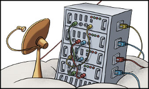

****************
Virtual machines
****************

* VMs are run on the Linux Qemu/KVM hypervisor.
* Virtual disks are stored in CEPH RBD volumes.

* The guest operating system is a 64-bit NixOS Linux managed by the Flying Circus.

    * Packages are installed through the managed components globally or in your
      service user using the `nix-env` utility. You are also free to compile
      things in your service users' home, however, on NixOS this can have
      suprising effects - talk to us if you need to do that.
    * We are always looking for more components to manage for you but as a
      general rule new managed components take their time to develop them.
      Contact us if you would like to see a managed component we do not yet
      support.
* VMs can be assigned resources:

    * 1-8 virtual CPU cores
    * 1-60GiB RAM
    * 30GiB-10+TiB disk (note that filesystems become unwieldy at a certain size)

* Resources can be resized:

    * CPU and RAM changes currently require a reboot of the VM.
    * Disks can be grown on the fly without a reboot.
    * Shrinking disks is not supported. Growing a disk is very fast and
      thus we recommend starting small and growing as needed. If you need
      to drastically shrink a disk you need to provision a new VM.

Maintenance
-----------

For every project our automatic maintenance window is by default set between
22:00 and 5:00 (Europe/Berlin) with a pre-announcement period of 24 hours.

When our tools notice that maintenance is required they will automatically
pick a window matching the configured limits and notify your technical contacts.

Reboot
------

Automated reboots are announced according to the maintenance schedule. Users
granted the `sudo-srv` permission are able to reboot a VM immediately by
calling::

  sudo shutdown -r now

Deletion
--------

VMs are deleted in a multi-stage process that takes around 38 days. You can
schedule the deletion of a VM at earliest for the next day (midnight
Europe/Berlin).

The stages of deletion are:

Prepare
  (t-5 days)

  Create a maintenance period to let technical contacts know that a VM
  is due for deletion soon.

  Also, add downtimes in our monitoring systems to stop any alerts related
  to the VM starting from their deletion date.

Soft
  (at t=0)

  Shutdown the VM but keep all existing records, IPs, disks, etc.

  At this point you can still cancel the deletion and start up the VM as it was
  including all persistent data.

Hard
  (t+3 days)

  Delete the VMs hard disk from activate storage.

  Also delete all records from our directory and allow the IPs to be reused.

Purge
  (t+8 days)

  Delete the VMs backups.

Recycle
  (t+38 days)

  Delete the VM deletion notice which will in turn allow the VMs name to
  be used again.
